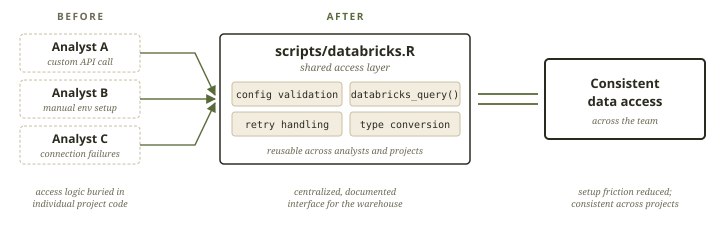
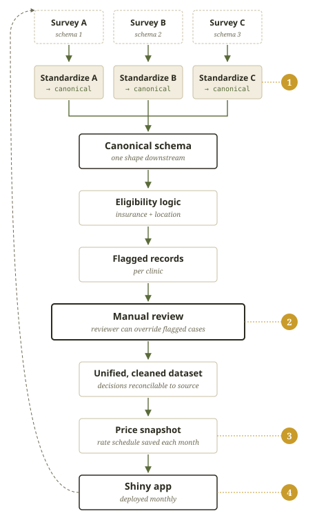

# From Silos to Systems: How I've Created Consistency Across a Broad Portfolio {.brief-title}

::: byline
**Emily Stern** · Data Analyst · May 2026
:::

::: toc
[This Role](#sec-01) · [Best practices](#sec-02) · [Durable systems](#sec-03) · [Commitment to growth](#sec-05) · [Live work](#sec-06)
:::

<!-- ============ SECTION 1: WHAT I HEARD ============ -->

:::: {#sec-01 .brief-section}
[01 — What I heard about the role]{.section-num}

The role, as I understood it, operates across two complementary priorities:

::: role-recap

Scaling (\~50%)

:   Help each line of business bring products to market faster by standardizing workflows and increasing operational capacity.

Research (\~50%)

:   Identify and implement practices that improve both model performance and adoption of the platform itself.

Core constraint

:   Each LOB brings its own approach to modeling. This creates an opportunity to identify shared patterns and standardize high-impact parts of the workflow—both upstream (data and feature development) and downstream (model review, deployment, and refresh)—to improve consistency and scale production-ready outputs.
:::

::: intro
I've prepared this brief to highlight how my previous experience could be leveraged to support the Earnix Design team. In my current role, I've worked to optimize our processes under similar constraints. The sections that follow show how I’ve approached this problem in practice, how I would get established in this role, as well as a brief demo of relevant work.
:::
::::

<!-- ============ SECTION 2: BEST PRACTICES & COLLABORATION ============ -->

:::::: {#sec-02 .brief-section}
[02 — Collaboration and Best Practices]{.section-num}

::: case
[CASE STUDY · STANDARDIZED DATA ACCESS]{.case-tag}

### What I built [Databricks access layer]{.repo}

During a period of tech stack transition, the team needed to access the warehouse before a standardized pattern had been fully implemented. Analysts were attempting to connect in different ways, which created friction and inconsistency.

In one project, I had written the connection logic needed to pull eviction data from the warehouse. When coworkers were unable to connect themselves, I pulled that logic into a shared script, [scripts/databricks.R]{.repo}, creating a consistent, documented interface for querying Databricks rather than requiring each analyst to write their own API calls.

This served as a bridge during the transition period, allowing the team to reliably access data while longer-term solutions (e.g., standardized data sharing patterns like Delta Sharing) were being implemented.

```{=html}
<div class="pipeline-chart pipeline-chart-wide">

</div>
```

**Impact**

- Established a consistent, reusable access pattern for querying Databricks across analysts.
- Reduced setup friction and dependency on individual project knowledge.
- Centralized connection handling, type conversion, and query execution logic in one place.
- Enabled reliable data access during a period of platform transition, improving continuity across projects.
:::

::::::

<!-- ============ SECTION 3: APPLYING BEST PRACTICES ============ -->

:::::::::: {#sec-03 .brief-section}
[03 — Applying Best Practices to Create Durable Systems]{.section-num}

:::::: case
[CASE STUDY · ELIGIBILITY & REIMBURSEMENT PIPELINE]{.case-tag}

### The problem

A stakeholder needed to reimburse partner clinics for a service whose pricing was changing month to month. The inputs were a set of incompatible surveys — different schemas, different field semantics — submitted by different clinics. Eligibility had to be determined per record using location and insurance logic, and the result had to be auditable enough that a human reviewer could trace dollars and decisions back to its source row.

### What I built

An ETL + review + delivery system that runs monthly, refreshes with new data, and feeds a Shiny app that the stakeholder uses to authorize reimbursements.

::::: pipeline-layout
::: pipeline-chart
{alt="Eligibility & reimbursement pipeline flow chart: three surveys are standardized into a canonical schema, run through eligibility logic, flagged records, manual review, then unified dataset, price snapshot, and Shiny app — refreshed monthly." height="auto" style="display:block;" width="auto"}
:::

::: pipeline-decisions
### The four architecture decisions that made it last

```{=html}
<ol class="decisions">
<li><span class="head">Standardization happens up front</span> Survey formats differ across clinics. Step one standardizes column names and inputs into a common format, then applies a single eligibility function so downstream code operates on a consistent schema.</li>
<li><span class="head">Manual review as part of the audit trail</span> Federal funding flows through this pipeline, so every reimbursement needs to be defensible. Clinics revise incomplete entries, reviewers push through ambiguous cases, and overrides are logged rather than overwritten.</li>
<li><span class="head">Prices are snapshotted, not recomputed</span> Rates change monthly, and each reimbursement is relative to rates in force at the time. The pipeline pulls a fresh pricing workbook each cycle and stores it with that month's run, so every decision is reconstructable.</li>
<li>
  <span class="head">Reliable monthly refreshes</span>
A two-stage batch pipeline handles updates: stage one cleans and flags data for review, and stage two calculates outputs and appends them to the app. With dependencies pinned via <code>renv</code>, the process has run reliably for 18 months with minimal maintenance.
</li>
</ol>
```
::::: stat
::: stat-num
\$1M+
:::
::: stat-text
in annual reimbursements\
authorized through this system
:::
:::
:::::
::::::


:::::
::::::::::

<!-- ============ SECTION 5: A SYSTEMS-FOCUSED APPROACH ============ -->
::::::: {#sec-05 .brief-section}
[05 — Growing in new domains]{.section-num}

My work has spanned education, eviction, maternal health, and more. The through-line in my experience isn't the subject matter, but the system underneath. How data moves, where decisions get made, and what breaks under load. Insurance pricing is a domain I haven't worked in directly, but I can offer my approach to producing excellent work in any subject area.

::::: phase-grid

::: phase
[Alignment]{.when}

### Understand the system and its constraints
I start by aligning on how the system currently works:

- Where workflows are consistent vs. where they diverge.
- How data flows from ingestion through modeling and deployment.
- Where the primary bottlenecks or sources of variability exist.


***Ask me about:*** *mapping clinic intake, surveys, and federal reimbursement rules into a single pipeline.*
:::

::: phase
[Exposure]{.when}

### Work within existing workflows
Before introducing changes, I spend time working within current processes:

- Running existing pipelines.
- Reproducing outputs.
- Identifying where friction shows up in practice.


***Ask me about:*** *linking student records to eviction filings with no shared identifiers.*
:::

::: phase
[Implementation]{.when}

### Introduce targeted, high-leverage improvements
Once patterns are clear, I focus on small, high-impact interventions:

- Standardizing repeated components.
- Creating shared modules or templates.
- Improving reproducibility and handoff between analysts.


***Ask me about:*** *building a Shiny dashboard that took stakeholder questions off my desk.*
:::

::: phase
[Insights]{.when}

### Translate improvements into scalable systems
As patterns stabilize, I focus on:

- Documenting and formalizing best practices.
- Ensuring adoption through usability and clear examples.
- Identifying opportunities to generalize solutions across teams.


***Ask me about:*** *a design system that started as one report but turned into 14.*
:::

:::::
:::::::

<!-- ============ SECTION 6: LIVE WORK ============ -->

::: {#sec-06 .brief-section}
[06 — Live work]{.section-num}

## Currently Deployed

Something you can poke at directly. This shiny app is deployed as an interactive dashboard backed by a Neon-hosted Postgres database, enabling real-time querying and exploration of NSF funding patterns.

```{=html}
<div class="iframe-slot">
  <iframe src="https://019df1c6-3ad9-2e4e-a581-1a7cb7832261.share.connect.posit.cloud/"
          width="100%" height="540" frameborder="0"
          style="display:block; border:0;"></iframe>
</div>
```
:::

<!-- ============ FOOTER ============ -->

::: brief-footer
EMILY STERN · [STERN.EMILY06\@GMAIL.COM](mailto:STERN.EMILY06@GMAIL.COM)
:::
